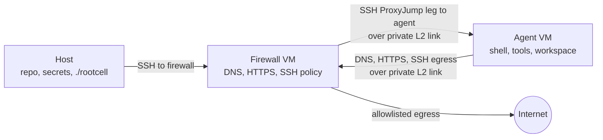

# rootcell

[](https://github.com/rootcell-ai/rootcell/actions/workflows/ci.yml)

Give the agent root in the cell, not on your host.

rootcell gives a coding agent a disposable local VM where it can use root without
touching your host filesystem. All outbound traffic passes through a separate
firewall VM with DNS, HTTPS, and SSH allowlists. HTTPS is routed through a
transparent decrypting proxy, so rootcell can enforce host policy and
`./rootcell spy` can show formatted Bedrock Runtime traffic when you need to see
what the agent is sending.

## Current Scope

rootcell is early and intentionally narrow. Today it targets:

- **Host OS:** macOS hosts.
- **LLM provider:** Amazon Bedrock / Bedrock Runtime.
- **Coding harness:** [Pi](https://pi.dev) inside the agent VM.

The agent and firewall environments are NixOS VMs, but the host-side lifecycle,
networking, Keychain integration, and VM lifecycle currently assume macOS.

## Why This Exists

Coding agents are most useful when they can run commands, install tools, and edit
files. That's a lot of trust to hand to a process with network access.

rootcell gives you a local workspace where an agent can exercise root inside the
VM without receiving broad access to your Mac:

- A fresh NixOS VM for the agent's shell and tools.
- No host-home mount in the agent VM.
- A separate firewall VM with the only public internet route.
- DNS, HTTPS, and SSH allowlists you can review and hot-reload.
- A per-VM SSH key for Git pushes.
- Provider secrets read from macOS Keychain at runtime, not stored in the VM or
  the Nix store.

Use it when you want the agent to go wild inside the VM, while keeping
an explicit network boundary around the work.

## How It Works



There is deliberately no direct Host-to-Agent path. Host sessions reach the
agent by connecting to the firewall first; SSH ProxyJump then carries the agent
session through the firewall to the agent across the private L2 link. The agent
VM also uses that same private L2 link for all DNS, HTTPS, and SSH egress; it
has no direct route to the Internet.

The two VMs have different jobs:

| Piece | What it does |
| --- | --- |
| `agent` VM | Runs the coding harness, shell commands, Git, build tools, and project work. It has root inside the VM, but no direct public internet route. |
| `firewall` VM | Owns the public egress path. It runs `dnsmasq` for DNS allowlisting and `mitmproxy` for HTTPS interception and SSH CONNECT policy. |
| `./rootcell` | Host-side wrapper that creates, provisions, updates, and enters the VMs. It also syncs allowlists and injects configured provider secrets for each session. |

Rootcell supports named instances. Plain `./rootcell` uses the `default`
instance and creates VMs named `agent` and `firewall`. `./rootcell --instance
dev` creates `agent-dev` and `firewall-dev`, with separate CA material,
allowlists, Keychain mappings, and a separate private VM link.

HTTPS egress is transparent from inside the agent VM. A normal command like
`curl https://github.com` either works because the host is allowlisted, or fails
because the firewall denies it. SSH is explicit because SSH has no SNI; the
agent VM's SSH config tunnels it through the firewall so hostnames can still be
allowlisted.

Cleartext HTTP is denied. All egress is expected to be HTTPS or SSH.

## Quick Start

You need:

- macOS. The current vfkit runtime path uses Apple's Virtualization Framework.
- [Bun](https://bun.sh), [vfkit](https://github.com/crc-org/vfkit),
  [zstd](https://facebook.github.io/zstd/), and Python 3 on the host `PATH`.
- macOS command-line tools used by rootcell: `curl`, `ssh`, `scp`,
  `ssh-keygen`, `openssl`, and `security`.
- Amazon Bedrock credentials stored in macOS Keychain.

The default published VM images target Apple Silicon hosts. Intel hosts require
the architecture changes described in [Changing Architecture](#changing-architecture).

The agent and firewall are still NixOS VMs, and provisioning runs Nix inside
those VMs. Host-side Nix is optional for end users: use it only if you choose
the Nix setup below or if you are building release images.

### Homebrew Setup

```bash
chmod +x ./rootcell

brew tap oven-sh/bun
brew install bun vfkit zstd python
bun install --frozen-lockfile

# Store the default Bedrock provider key in Keychain.
security add-generic-password -a "$USER" -s aws-bedrock-api-key -w "<your-key>"

# Start rootcell.
./rootcell
```

### Nix Setup

From the repository root:

```bash
chmod +x ./rootcell

nix profile install .#hostTools
bun install --frozen-lockfile

# Store the default Bedrock provider key in Keychain.
security add-generic-password -a "$USER" -s aws-bedrock-api-key -w "<your-key>"

./rootcell
```

For a one-off shell instead of a profile install:

```bash
nix shell .#hostTools --command bun install --frozen-lockfile
nix shell .#hostTools --command ./rootcell
```

If your host Nix install has not enabled flakes and the new CLI yet, add
`--extra-experimental-features 'nix-command flakes'` to the host-side `nix`
commands above.

First run downloads compatible rootcell VM images from the configured release
manifest, creates instance-local vfkit disks, and provisions the VMs. Later runs
normally take seconds.

### Host Runtime

rootcell does not install or build host tools at runtime. It expects `bun`,
`vfkit`, `zstd`, and `python3` to be available from your chosen package manager.
For non-standard paths, set:

```bash
ROOTCELL_VFKIT=/path/to/vfkit
ROOTCELL_ZSTD=/path/to/zstd
ROOTCELL_PYTHON=/path/to/python3
```

vfkit is the supported VM runtime:

```bash
./rootcell
```

Image resolution is controlled by:

```bash
ROOTCELL_IMAGE_MANIFEST_URL=https://github.com/rootcell-ai/rootcell/releases/latest/download/manifest.json
ROOTCELL_IMAGE_DIR=/path/to/local/rootcell-image-dist
```

`ROOTCELL_IMAGE_DIR` must contain `manifest.json` plus the image files named in
that manifest. Image build definitions now live in `images/` and are exposed by
this repository's root flake. The default manifest URL points at this
repository's GitHub Release assets.

## Daily Workflow

```bash
./rootcell                        # open a bash shell inside the agent VM
./rootcell pi                     # run pi directly
./rootcell -- nix flake update    # run any command inside the agent VM
./rootcell allow                  # reload network allowlists after editing them
./rootcell provision              # rebuild/re-provision after VM Nix or pi config edits
./rootcell pubkey                 # print the agent VM's SSH public key
./rootcell spy                    # tail formatted Bedrock Runtime traffic
./rootcell spy --raw              # include sanitized raw JSON bodies too
./rootcell spy --tui              # browse Bedrock Runtime traffic interactively

./rootcell --instance dev         # open the dev instance shell
./rootcell --instance dev allow   # reload only the dev instance allowlists
```

## Allowing Network Access

Network policy is per instance. On first run, `./rootcell` copies each tracked
`proxy/*.defaults` file to `.rootcell/instances/<name>/proxy/`:

- `.rootcell/instances/default/proxy/allowed-dns.txt` controls which hostnames can resolve.
- `.rootcell/instances/default/proxy/allowed-https.txt` controls which HTTPS hosts can be reached.
- `.rootcell/instances/default/proxy/allowed-ssh.txt` controls which SSH hosts can be reached.

For most HTTPS access, add the host to both DNS and HTTPS, then reload:

```bash
$EDITOR .rootcell/instances/default/proxy/allowed-dns.txt
$EDITOR .rootcell/instances/default/proxy/allowed-https.txt
./rootcell allow
```

For Git over SSH, add the host to the instance's `allowed-ssh.txt` and run
`./rootcell allow`. GitHub, GitLab, Bitbucket, and Azure DevOps are included in the
default SSH allowlist.

Reloading allowlists takes about a second and does not rebuild either VM. To
reset a live allowlist to project defaults, delete the live file and run
`./rootcell`; it will be re-seeded from its `.defaults` sibling. For a named
instance, use the same paths under `.rootcell/instances/<name>/proxy/` and run
`./rootcell --instance <name> allow`.

## Common Changes

After editing these files, run `./rootcell provision`:

- `flake.nix`, `common.nix`, `agent-vm.nix`, `firewall-vm.nix`, or `home.nix`
- Anything under `pi/`
- The checked-in allowlist defaults

For live allowlist edits only, use `./rootcell allow`.

### Add Tools

Edit `home.packages` in `home.nix`, then run:

```bash
./rootcell provision
```

### Customize Pi

The agent VM is preconfigured to run [Pi](https://pi.dev). Support for other
coding harnesses is on the roadmap.

Everything under `pi/agent/` on the host is symlinked into `~/.pi/agent/` inside
the agent VM.

- `pi/agent/AGENTS.md` becomes the global instruction file.
- `pi/agent/skills/<name>/SKILL.md` becomes a global pi skill.

Add or edit files there, then run `./rootcell provision`.

Per-project rules still belong in an `AGENTS.md` or `CLAUDE.md` at the root of
the project you are working on inside the VM.

### Push to GitHub, etc

The agent VM generates its own RSA SSH keypair on first provision. The private
key stays in the VM; the public key is meant to be registered with GitHub,
GitLab, Bitbucket, Azure DevOps, or a deploy key.

```bash
./rootcell pubkey
```

After registering the key, `git push` works from inside the agent VM as long as
the host is on that instance's `allowed-ssh.txt`.

## Security Model

rootcell is designed to reduce accidental and routine agent egress, not to be a
complete data-loss-prevention system.

What it does:

- Keeps the host filesystem out of the VM by avoiding default host mounts.
- Gives the agent VM only a private link to the firewall VM.
- Routes DNS through a suffix allowlist.
- Intercepts HTTPS at the firewall and checks both TLS SNI and HTTP `Host`.
- Validates the upstream certificate before sending bytes onward.
- Denies cleartext HTTP instead of allowlisting unauthenticated `Host` headers.

What remains your responsibility:

- Be careful with broad wildcards such as `*.cloudfront.net` or
  `*.githubusercontent.com`; allowed shared infrastructure can become an exfil
  path.
- Avoid allowlisting DNS-over-HTTPS endpoints unless you really need them.
- Treat any allowed writeable service as a possible outbound channel.
- Remember that network policy cannot prevent timing channels or encoded data in
  legitimate requests.

Known technical gaps and operational debugging notes live in
[proxy/README.md](proxy/README.md).

## Roadmap

rootcell's current goal is to make the narrow macOS + Bedrock + Pi path solid
before broadening the support matrix. Planned expansion includes:

- **Host compatibility:** support both macOS and Linux hosts.
- **LLM providers:** add OpenAI and Anthropic alongside Amazon Bedrock.
- **Coding harnesses:** support Codex CLI and Claude Code CLI alongside Pi.

The long-term shape is a provider- and harness-pluggable local VM boundary, with
the same explicit network policy model across supported hosts.

## Project Layout

```text
rootcell                 host entry point for VM lifecycle and commands
src/                     Bun TypeScript implementation for migrated entrypoints
flake.nix                Nix inputs, guest VM configs, images, and optional host tools
common.nix               shared NixOS config for both VMs
agent-vm.nix             agent VM network and trust-store config
firewall-vm.nix          firewall VM services and nftables rules
home.nix                 pi, Git, SSH, and developer tools for the agent VM
network.nix              default inter-VM network settings
.env.defaults            seed values for per-instance `.env`
secrets.env.defaults     seed Keychain secret mappings for per-instance `secrets.env`
.rootcell/               gitignored per-instance state, allowlists, CA, and generated files
proxy/                   allowlists and mitmproxy/dnsmasq firewall code
  agent_spy.py           Bedrock Runtime formatter for `./rootcell spy`
  agent_spy_tui.py       Textual browser for `./rootcell spy --tui`
pi/agent/                global pi instructions, skills, and extensions
completions/             bash and zsh completion for `rootcell`
```

## VM Lifecycle

vfkit instance state lives under `.rootcell/instances/<name>/vfkit/`. The host
control key and generated SSH config live under `.rootcell/instances/<name>/ssh/`.
The agent VM is reached through SSH ProxyJump via the firewall VM; no VSOCK
device is attached on the vfkit path.

## Configuration

### Environment

`./rootcell` seeds `.rootcell/instances/<name>/.env` from `.env.defaults` on
first run. Edit that file for instance-local settings such as:

```sh
AWS_REGION=us-west-2
ROOTCELL_SUBNET_POOL_START=192.168.100.0
ROOTCELL_SUBNET_POOL_END=192.168.254.0
```

The first run also writes `.rootcell/instances/<name>/state.json` with the
instance's allocated `/24`. By default, rootcell chooses the first free subnet
from `192.168.100.0/24` through `192.168.254.0/24`, uses `.2` for the firewall,
and uses `.3` for the agent. Existing state is not recalculated if you later
edit the pool values.

To pin a new instance to a specific subnet before first run, set both IPs in
that instance's `.env`:

```sh
FIREWALL_IP=192.168.109.2
AGENT_IP=192.168.109.3
NETWORK_PREFIX=24
```

`./rootcell` also seeds `.rootcell/instances/<name>/secrets.env` from
`secrets.env.defaults` on first run. This file maps agent VM environment
variable names to macOS Keychain service names; it does not contain the secret
values themselves:

```sh
AWS_BEARER_TOKEN_BEDROCK=aws-bedrock-api-key
```

For example, to inject an additional `ANTHROPIC_API_KEY`:

```sh
security add-generic-password -a "$USER" -s anthropic-api-key -w "<your-key>"
echo 'ANTHROPIC_API_KEY=anthropic-api-key' >> .rootcell/instances/default/secrets.env
```

If you want to use Anthropic or OpenAI subscriptions, you can log in from
inside the VM.

Do not put provider keys in `home.nix`; the Nix store is world-readable.

### Shell Completions

`rootcell completion` prints the yargs-generated completion script. The checked-in
files under `completions/` are generated from that command; refresh them with
`bun run completions` after changing commands or options. The generated scripts
register `rootcell`, so put `rootcell` on `PATH` before sourcing or installing
them.

For zsh, after `compinit`:

```sh
rootcell completion >> ~/.zshrc
```

For bash:

```sh
rootcell completion >> ~/.bashrc
```

### Changing Architecture

The default configuration is for Apple Silicon hosts with `aarch64-linux`
guests. For Intel Macs or x86 Linux guests, update these together:

- `system` in `flake.nix`
- The pi release tarball URL and hash in `home.nix`
- The image build outputs and release assets under `images/`

### Multiple Instances

Named instances are isolated from each other:

```bash
./rootcell --instance dev
./rootcell --instance review
```

Each instance gets its own VMs, state directory, CA, allowlists, Keychain mapping
file, control SSH key, private-link state, and `/24`.

The `default` instance migrates from legacy repo-local files on first run: if
`.env`, `secrets.env`, `proxy/allowed-*.txt`, or `pki/` already exist, rootcell
copies them into `.rootcell/instances/default/`. Named instances seed from the
checked-in defaults.

## Troubleshooting

See formatted Bedrock Runtime requests and responses:

```bash
./rootcell spy
./rootcell spy --raw
./rootcell spy --tui
```

Check that firewall services are listening:

```bash
ssh -F .rootcell/instances/default/ssh/config rootcell-firewall -- \
  "ss -tln '( sport = :8080 or sport = :8081 )' && ss -uln '( sport = :53 )'"
```

Test an HTTPS allowlist entry from inside the VM:

```bash
./rootcell -- curl -v https://example.com
```

Inspect the live allowlists inside the firewall VM:

```bash
ssh -F .rootcell/instances/default/ssh/config rootcell-firewall -- \
  "cat /etc/agent-vm/allowed-https.txt && cat /etc/agent-vm/dnsmasq-allowlist.conf"
```

## License

Copyright (C) 2026 Jim Pudar.

rootcell is licensed under the GNU Affero General Public License v3.0 only
(`AGPL-3.0-only`). See [LICENSE](LICENSE).
