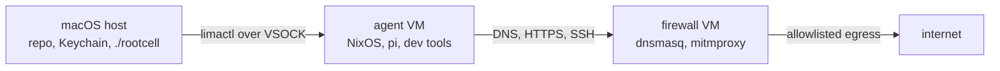

# rootcell

[](https://github.com/jimpudar/rootcell/actions/workflows/ci.yml)

Give the agent root in the cell, not on your host.

rootcell gives a coding agent a disposable local VM where it can use root without
touching your host filesystem. All outbound traffic passes through a separate
firewall VM with DNS, HTTPS, and SSH allowlists. HTTPS is routed through a
transparent decrypting proxy, so rootcell can enforce host policy and
`./rootcell spy` can show formatted Bedrock Runtime traffic when you need to see
what the agent is sending.

## Current Scope

rootcell is early and intentionally narrow. Today it targets:

- **Host OS:** macOS hosts.
- **LLM provider:** Amazon Bedrock / Bedrock Runtime.
- **Coding harness:** [Pi](https://pi.dev) inside the agent VM.

The agent and firewall environments are NixOS VMs, but the host-side lifecycle,
networking, Keychain integration, and Lima configuration currently assume macOS.

## Why This Exists

Coding agents are most useful when they can run commands, install tools, and edit
files. That's a lot of trust to hand to a process with network access.

rootcell gives you a local workspace where an agent can exercise root inside the
VM without receiving broad access to your Mac:

- A fresh NixOS VM for the agent's shell and tools.
- No default host-home mount from Lima.
- A separate firewall VM with the only public internet route.
- DNS, HTTPS, and SSH allowlists you can review and hot-reload.
- A per-VM SSH key for Git pushes.
- Provider secrets read from macOS Keychain at runtime, not stored in the VM or
  the Nix store.

Use it when you want the agent to go wild inside the VM, while keeping
an explicit network boundary around the work.

## How It Works



The two VMs have different jobs:

| Piece | What it does |
| --- | --- |
| `agent` VM | Runs `pi`, shell commands, Git, build tools, and project work. It has root inside the VM, but no direct public internet route. |
| `firewall` VM | Owns the public egress path. It runs `dnsmasq` for DNS allowlisting and `mitmproxy` for HTTPS interception and SSH CONNECT policy. |
| `./rootcell` | Host-side wrapper that creates, provisions, updates, and enters the VMs. It also syncs allowlists and injects configured provider secrets for each session. |

HTTPS egress is transparent from inside the agent VM. A normal command like
`curl https://github.com` either works because the host is allowlisted, or fails
because the firewall denies it. SSH is explicit because SSH has no SNI; the
agent VM's SSH config tunnels it through the firewall so hostnames can still be
allowlisted.

Cleartext HTTP is denied. All egress is expected to be HTTPS or SSH.

## Quick Start

You need:

- macOS with [Lima](https://lima-vm.io) installed.
- [Nix](https://nixos.org/download) installed.
- Amazon Bedrock credentials stored in macOS Keychain.

The default VM build targets Apple Silicon hosts. Intel hosts require the
architecture changes described in [Changing Architecture](#changing-architecture).

If your host Nix install has not enabled flakes and the new CLI yet, add
`--extra-experimental-features 'nix-command flakes'` to host-side `nix`
commands, for example:
`nix --extra-experimental-features 'nix-command flakes' build .#socket_vmnet`.

The easiest path is to run `./rootcell` once and follow the exact commands it
prints. The full one-time setup is:

```bash
chmod +x ./rootcell

# Build the Lima vmnet helper packaged by this flake.
nix build .#socket_vmnet

# Install it at the root-owned path Lima expects.
sudo install -m 0755 -d /opt/socket_vmnet/bin
sudo install -m 0755 result/bin/* /opt/socket_vmnet/bin/

# Let Lima use that helper without asking for sudo on every VM start.
limactl sudoers | sudo tee /private/etc/sudoers.d/lima

# Store the default Bedrock provider key in Keychain.
security add-generic-password -a "$USER" -s aws-bedrock-api-key -w "<your-key>"

# Start rootcell.
./rootcell
```

Why the one sudo install? Lima's `lima:host` network uses macOS
`vmnet.framework`, which requires the privileged `socket_vmnet` helper at a
root-owned path. The helper binary itself is built from this repo's flake; the
imperative part is only copying it into `/opt/socket_vmnet/bin`.

First run usually takes about 15 minutes because both VMs are created and
rebuilt. Later runs normally take seconds.

## Daily Workflow

```bash
./rootcell                        # open a bash shell inside the agent VM
./rootcell pi                     # run pi directly
./rootcell -- nix flake update    # run any command inside the agent VM
./rootcell allow                  # reload network allowlists after editing them
./rootcell provision              # rebuild/re-provision after Nix or pi config edits
./rootcell pubkey                 # print the agent VM's SSH public key
./rootcell spy                    # tail formatted Bedrock Runtime traffic
./rootcell spy --raw              # include sanitized raw JSON bodies too
./rootcell spy --tui              # browse Bedrock Runtime traffic interactively
```

## Allowing Network Access

Network policy lives in `proxy/`. On first run, `./rootcell` copies each tracked
`.defaults` file to a gitignored live file:

- `proxy/allowed-dns.txt` controls which hostnames can resolve.
- `proxy/allowed-https.txt` controls which HTTPS hosts can be reached.
- `proxy/allowed-ssh.txt` controls which SSH hosts can be reached.

For most HTTPS access, add the host to both DNS and HTTPS, then reload:

```bash
$EDITOR proxy/allowed-dns.txt
$EDITOR proxy/allowed-https.txt
./rootcell allow
```

For Git over SSH, add the host to `proxy/allowed-ssh.txt` and run
`./rootcell allow`. GitHub, GitLab, Bitbucket, and Azure DevOps are included in the
default SSH allowlist.

Reloading allowlists takes about a second and does not rebuild either VM. To
reset a live allowlist to project defaults, delete the live file and run
`./rootcell`; it will be re-seeded from its `.defaults` sibling.

## Common Changes

After editing these files, run `./rootcell provision`:

- `flake.nix`, `common.nix`, `agent-vm.nix`, `firewall-vm.nix`, or `home.nix`
- Anything under `pi/`
- The checked-in allowlist defaults

For live allowlist edits only, use `./rootcell allow`.

### Add Tools

Edit `home.packages` in `home.nix`, then run:

```bash
./rootcell provision
```

### Customize Pi

The agent VM is preconfigured to run [Pi](https://pi.dev). Support for other
coding harnesses is on the roadmap.

Everything under `pi/agent/` on the host is symlinked into `~/.pi/agent/` inside
the agent VM.

- `pi/agent/AGENTS.md` becomes the global instruction file.
- `pi/agent/skills/<name>/SKILL.md` becomes a global pi skill.

Add or edit files there, then run `./rootcell provision`.

Per-project rules still belong in an `AGENTS.md` or `CLAUDE.md` at the root of
the project you are working on inside the VM.

### Push to GitHub, etc

The agent VM generates its own RSA SSH keypair on first provision. The private
key stays in the VM; the public key is meant to be registered with GitHub,
GitLab, Bitbucket, Azure DevOps, or a deploy key.

```bash
./rootcell pubkey
```

After registering the key, `git push` works from inside the agent VM as long as
the host is on `proxy/allowed-ssh.txt`.

## Security Model

rootcell is designed to reduce accidental and routine agent egress, not to be a
complete data-loss-prevention system.

What it does:

- Keeps the host filesystem out of the VM by disabling Lima's default mounts.
- Gives the agent VM only a private link to the firewall VM.
- Routes DNS through a suffix allowlist.
- Intercepts HTTPS at the firewall and checks both TLS SNI and HTTP `Host`.
- Validates the upstream certificate before sending bytes onward.
- Denies cleartext HTTP instead of allowlisting unauthenticated `Host` headers.

What remains your responsibility:

- Be careful with broad wildcards such as `*.cloudfront.net` or
  `*.githubusercontent.com`; allowed shared infrastructure can become an exfil
  path.
- Avoid allowlisting DNS-over-HTTPS endpoints unless you really need them.
- Treat any allowed writeable service as a possible outbound channel.
- Remember that network policy cannot prevent timing channels or encoded data in
  legitimate requests.

Known technical gaps and operational debugging notes live in
[proxy/README.md](proxy/README.md).

## Roadmap

rootcell's current goal is to make the narrow macOS + Bedrock + Pi path solid
before broadening the support matrix. Planned expansion includes:

- **Host compatibility:** support both macOS and Linux hosts.
- **LLM providers:** add OpenAI and Anthropic alongside Amazon Bedrock.
- **Coding harnesses:** support Codex CLI and Claude Code CLI alongside Pi.

The long-term shape is a provider- and harness-pluggable local VM boundary, with
the same explicit network policy model across supported hosts.

## Project Layout

```text
rootcell                 host entry point for VM lifecycle and commands
flake.nix                Nix inputs, VM outputs, and host packages
common.nix               shared NixOS config for both VMs
agent-vm.nix             agent VM network and trust-store config
firewall-vm.nix          firewall VM services and nftables rules
home.nix                 pi, Git, SSH, and developer tools for the agent VM
nixos.yaml               Lima config for the agent VM
firewall.yaml            Lima config for the firewall VM
network.nix              default inter-VM network settings
.env.defaults            seed values for local `.env`
secrets.env.defaults     seed Keychain secret mappings for local `secrets.env`
proxy/                   allowlists and mitmproxy/dnsmasq firewall code
  agent_spy.py           Bedrock Runtime formatter for `./rootcell spy`
  agent_spy_tui.py       Textual browser for `./rootcell spy --tui`
pi/agent/                global pi instructions, skills, and extensions
completions/             bash and zsh completion for `rootcell`
pkgs/socket_vmnet.nix    local package for Lima's vmnet helper
```

## VM Lifecycle

Stop the VMs but keep their disks and Nix store caches:

```bash
limactl stop agent
limactl stop firewall
./rootcell
```

Delete the VMs for a clean slate:

```bash
limactl delete agent firewall --force
./rootcell
```

If you edit `nixos.yaml` or `firewall.yaml`, Lima will not apply those changes
to existing VMs automatically. Either run `limactl edit <name>` or delete and
recreate the VM.

## Configuration

### Environment

`./rootcell` seeds `.env` from `.env.defaults` on first run. Edit `.env` for local
settings such as:

```sh
AWS_REGION=us-west-2
LIMA_NETWORK=host
FIREWALL_IP=192.168.106.2
AGENT_IP=192.168.106.3
NETWORK_PREFIX=24
```

`./rootcell` also seeds `secrets.env` from `secrets.env.defaults` on first run.
This file maps agent VM environment variable names to macOS Keychain service
names; it does not contain the secret values themselves:

```sh
AWS_BEARER_TOKEN_BEDROCK=aws-bedrock-api-key
```

For example, to inject an additional `ANTHROPIC_API_KEY`:

```sh
security add-generic-password -a "$USER" -s anthropic-api-key -w "<your-key>"
echo 'ANTHROPIC_API_KEY=anthropic-api-key' >> secrets.env
```

If you want to use Anthropic or OpenAI subscriptions, you can log in from
inside the VM.

Do not put provider keys in `home.nix`; the Nix store is world-readable.

### Shell Completions

Both completion files register `rootcell` and `./rootcell`, including the
`provision`, `allow`, `pubkey`, and `spy` subcommands.

For zsh, after `compinit`:

```sh
source /path/to/rootcell/completions/rootcell.zsh
```

For bash:

```sh
source /path/to/rootcell/completions/rootcell.bash
```

### Changing Architecture

The default configuration is for Apple Silicon hosts with `aarch64-linux`
guests. For Intel Macs or x86 Linux guests, update these together:

- `system` in `flake.nix`
- The pi release tarball URL and hash in `home.nix`
- The image URL, `arch`, and digest in both Lima YAML files

### Multiple macOS User Accounts

The default Lima `host` network is backed by a system-wide macOS vmnet bridge.
If two macOS users run rootcell with the same default subnet, the VMs can
collide.

For the second account, create a separate Lima host-mode network in
`~/.lima/_config/networks.yaml`:

```yaml
networks:
  host2:
    mode: host
    gateway: 192.168.107.1
    dhcpEnd: 192.168.107.254
    netmask: 255.255.255.0
```

Mirror that network entry in the first account too, then refresh the system-wide
sudoers file once:

```bash
limactl sudoers | sudo tee /private/etc/sudoers.d/lima
```

In the second account's `.env`, choose VM IPs inside that subnet. Do not use the
`.1` gateway address; macOS owns it for the bridge.

```sh
LIMA_NETWORK=host2
FIREWALL_IP=192.168.107.2
AGENT_IP=192.168.107.3
NETWORK_PREFIX=24
```

Then recreate that account's VMs:

```bash
limactl delete agent firewall --force
./rootcell
```

If the VMs look correctly configured but cannot reach each other, stop them and
remove the stale `socket_vmnet` daemon files for that network before starting
again.

## Troubleshooting

See what the firewall is denying:

```bash
limactl shell firewall -- journalctl -u mitmproxy-explicit -u mitmproxy-transparent -u dnsmasq -f
```

See formatted Bedrock Runtime requests and responses:

```bash
./rootcell spy
./rootcell spy --raw
./rootcell spy --tui
```

Check that firewall services are listening:

```bash
limactl shell firewall -- ss -tln '( sport = :8080 or sport = :8081 )'
limactl shell firewall -- ss -uln '( sport = :53 )'
```

Test an HTTPS allowlist entry from inside the VM:

```bash
./rootcell -- curl -v https://example.com
```

Inspect the live allowlists inside the firewall VM:

```bash
limactl shell firewall -- cat /etc/agent-vm/allowed-https.txt
limactl shell firewall -- cat /etc/agent-vm/dnsmasq-allowlist.conf
```
