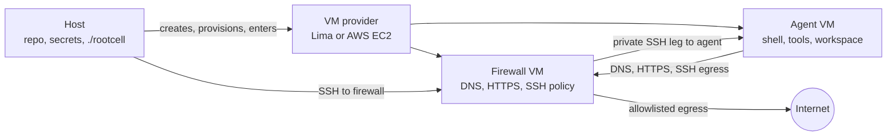

[](https://github.com/rootcell-ai/rootcell/actions/workflows/ci.yml)

Give the agent root in the cell, not on your host.

rootcell gives a coding agent disposable NixOS VMs where it can use root without
touching your host filesystem. All outbound traffic passes through a separate
firewall VM with DNS, HTTPS, and SSH allowlists. HTTPS is routed through a
transparent decrypting proxy, so rootcell can enforce host policy and
`./rootcell spy` can open a local browser view of captured Bedrock Runtime
traffic when you need to see what the agent is sending.

rootcell is provider-backed: the same agent/firewall model can run locally on
macOS with Lima or remotely in AWS EC2.

## Current Scope

rootcell is early and intentionally narrow. Today it supports:

| Area | Current support |
| --- | --- |
| VM providers | `lima` for local macOS + Lima, and `aws-ec2` for AWS EC2 |
| Guest OS | AARCH64 NixOS agent and firewall VMs |
| Coding harness | [Pi](https://pi.dev) inside the agent VM |
| Containers | Rootful Docker, enabled at boot inside the agent VM |
| Network policy | DNS, HTTPS, and SSH egress through the firewall VM |
| Secrets | Host-side secret providers, including macOS Keychain and AWS Secrets Manager |

Provider-specific setup and operational details live in:

- [macOS + Lima provider](src/rootcell/providers/macos-lima-user-v2/README.md)
- [AWS EC2 provider](src/rootcell/providers/aws-ec2/README.md)

## Why This Exists

Coding agents are most useful when they can run commands, install tools, and edit
files. That's a lot of trust to hand to a process with network access.

rootcell gives you a workspace where an agent can exercise root inside the VM
without receiving broad access to your host:

- A fresh NixOS VM for the agent's shell and tools.
- No host-home mount in the agent VM.
- A separate firewall VM with the only public internet route.
- DNS, HTTPS, and SSH allowlists you can review and hot-reload.
- A per-VM SSH key for Git pushes.
- Provider secrets read from host-side secret providers at runtime, not stored
  in the VM or the Nix store.

Use it when you want the agent to do real work inside a VM while keeping an
explicit network boundary around that work.

## How It Works


```mermaid
flowchart LR
  Internet(("Internet"))
  Host["Host<br/>repo, secrets, ./rootcell"]
  Provider["VM provider<br/>Lima or AWS EC2"]
  Firewall["Firewall VM<br/>DNS, HTTPS, SSH policy"]
  Agent["Agent VM<br/>shell, tools, workspace"]

  Host -->|creates, provisions, enters| Provider
  Provider --> Firewall
  Provider --> Agent
  Host -->|SSH to firewall| Firewall
  Firewall -->|private SSH leg to agent| Agent
  Agent -->|DNS, HTTPS, SSH egress| Firewall
  Firewall -->|allowlisted egress| Internet
```

rootcell deliberately does not use a direct Host-to-Agent path. Host sessions
reach the agent by connecting to the firewall first; SSH ProxyJump then carries
the agent session through the provider's private network path. The agent VM also
uses that private path for all DNS, HTTPS, and SSH egress; it has no direct
public route.

The provider owns how those VMs and networks exist:

- macOS + Lima uses two local Lima VMs and a Lima user-v2 private network.
- AWS EC2 uses two EC2 instances, a dedicated VPC, and OpenTofu-managed
  networking.

The two VMs have the same roles in either provider:

| Piece | What it does |
| --- | --- |
| `agent` VM | Runs the coding harness, shell commands, Git, Docker containers, build tools, and project work. It has root inside the VM, but no direct public internet route. |
| `firewall` VM | Owns the public egress path. It runs `dnsmasq` for DNS allowlisting and `mitmproxy` for HTTPS interception and SSH CONNECT policy. |
| `./rootcell` | Host-side wrapper that creates, provisions, updates, and enters the VMs. It also syncs allowlists and injects configured provider secrets for each session. |

Rootcell supports named instances. Plain `./rootcell` uses the selected default
instance, initially `default`, and creates VMs named `agent` and `firewall` for
that default instance. `./rootcell select dev` makes `dev` the default target.
`./rootcell --instance dev` overrides the selected default for one invocation
and creates `agent-dev` and `firewall-dev`, with separate CA material,
allowlists, secret mappings, provider state, and private network configuration.

HTTPS egress is transparent from inside the agent VM. A normal command like
`curl https://github.com` either works because the host is allowlisted, or fails
because the firewall denies it. SSH is explicit because SSH has no SNI; the
agent VM's SSH config tunnels it through the firewall so hostnames can still be
allowlisted.

Cleartext HTTP is denied. All egress is expected to be HTTPS or SSH.

## Quick Start

You need the common host tools:

- [Bun](https://bun.sh) for the TypeScript CLI.
- `curl`, `ssh`, `scp`, `ssh-keygen`, and `openssl`.
- Provider-specific tools from the provider README.

On macOS with Homebrew:

```bash
brew tap oven-sh/bun
brew install bun
brew install lima       # for the macOS + Lima provider
brew install opentofu   # for the AWS EC2 provider

chmod +x ./rootcell
bun install --frozen-lockfile
```

On macOS with Nix:

```bash
nix profile install .#hostTools

chmod +x ./rootcell
bun install --frozen-lockfile
```

For a one-off shell instead of a profile install:

```bash
nix shell .#hostTools --command bun install --frozen-lockfile
nix shell .#hostTools --command ./rootcell
```

If your host Nix install has not enabled flakes and the new CLI yet, add
`--extra-experimental-features 'nix-command flakes'` to the host-side `nix`
commands above.

Choose a provider before first use.

### macOS + Lima

The local Lima provider is the default:

```bash
./rootcell --init-env macos-lima

# Store the default Bedrock provider key in Keychain.
security add-generic-password -a "$USER" -s aws-bedrock-api-key -w "<your-key>"

./rootcell
```

See [macOS + Lima provider](src/rootcell/providers/macos-lima-user-v2/README.md)
for Lima requirements, Nix host-tool setup, state layout, and architecture
notes.

### AWS EC2

Initialize the instance `.env` before the first run:

```bash
./rootcell -i aws-dev --init-env aws-ec2
./rootcell -i aws-dev edit env

./rootcell -i aws-dev
```

See [AWS EC2 provider](src/rootcell/providers/aws-ec2/README.md) for the
OpenTofu/Terraform layout, AWS resource ownership, AMI selection, and IAM
isolation details.

First run creates the provider resources and provisions both VMs. Provisioning
uses Nix inside the VMs, but you do not need Nix installed on the host unless
you choose a Nix-based host-tool setup for the Lima provider.

Later runs normally take seconds unless the VMs were stopped or provisioning
inputs changed.

## Host Runtime

rootcell does not install or build host tools at runtime. It expects provider
tools to be available from your chosen package manager or an override
environment variable:

```bash
ROOTCELL_LIMACTL=/path/to/limactl      # Lima provider
ROOTCELL_TERRAFORM=/path/to/tofu       # AWS EC2 provider
```

The Lima provider requires Lima 2.0.2 or newer for `ssh.overVsock`; use
`nix shell .#hostTools --command ./rootcell` if your PATH has an older
`limactl`.

The AWS EC2 provider uses OpenTofu's `tofu` command by default. Set
`ROOTCELL_TERRAFORM=/path/to/terraform` if you want to use a Terraform binary
you installed yourself.

Per-instance state defaults to `instances/<name>` under the current repo. Set
`ROOTCELL_STATE_DIR=/path/to/rootcell-instances` to use a different persistent
state root.

## Daily Workflow

```bash
./rootcell                        # open a bash shell inside the agent VM
./rootcell select dev             # use the dev instance by default
./rootcell -- pi                  # run pi directly
./rootcell -- nix flake update    # run any command inside the agent VM
./rootcell copy ./file :/tmp/     # copy a host file into the agent VM
./rootcell copy -r :/tmp/out ./out # copy files back from the agent VM recursively
./rootcell edit env               # edit the instance .env in $EDITOR
./rootcell edit http              # edit the HTTPS allowlist in $EDITOR
./rootcell edit dns               # edit the DNS allowlist in $EDITOR
./rootcell edit ssh               # edit the SSH allowlist in $EDITOR
./rootcell edit extensions        # edit instance extension opt-ins in $EDITOR
./rootcell allow                  # reload network allowlists after editing them
./rootcell provision              # rebuild/re-provision after VM Nix or pi config edits
./rootcell pubkey                 # print the agent VM's SSH public key
./rootcell list                   # list rootcell VMs and their current state
./rootcell stop --instance dev    # stop the dev instance VMs
./rootcell remove --instance dev  # stop dev and delete its provider VM state
./rootcell spy                    # open the browser spy through a local SSH tunnel
./rootcell extension list         # show optional extensions for this instance
./rootcell extension enable claude-code      # enable an extension for next provision
./rootcell -i aws-dev --init-env aws-ec2     # initialize a provider-specific instance .env
./rootcell -i local --init-env macos-lima    # initialize an explicit local Lima .env

./rootcell --instance dev           # open the dev instance shell once
./rootcell --instance dev edit env  # edit the dev instance environment once
./rootcell --instance dev edit dns  # edit the dev instance DNS allowlist once
./rootcell --instance dev allow     # reload only the dev instance allowlists once
```

Detailed browser spy operator and developer notes live in
[src/spy/README.md](src/spy/README.md).

## Extensions

Rootcell extensions are per-instance opt-ins for optional Rootcell capabilities.
They are rootcell concepts, not Pi concepts. Some extensions install Pi
resources, but others could add VM packages, host commands, local tunnels,
firewall services, protocol support, allowlists, or guest NixOS and Home Manager
modules without involving Pi at all.
For example, a future `lazyvim` extension could install editor tooling in the
agent VM, while an `ftp` extension could add firewall protocol support and
allowlist entries.

The first built-ins are `claude-code`, `pi-plannotator`, and `pi-subagents`.
Older `plannotator` and `subagent` keys in `extensions.txt` are migrated to
the Pi-prefixed names when rootcell rewrites the file.

Each instance stores its enabled extensions in
`instances/<name>/extensions.txt`, or under the configured
`ROOTCELL_STATE_DIR`. The file is seeded with all known extensions disabled.
Enabling or disabling an extension only edits that file; run
`./rootcell provision` afterward to apply VM changes.

```bash
./rootcell extension list
./rootcell extension enable claude-code
./rootcell extension enable pi-plannotator
./rootcell extension disable pi-plannotator
./rootcell edit extensions

./rootcell --instance dev extension list
./rootcell --instance dev extension enable pi-subagents
./rootcell --instance dev provision
```

### Claude Code

The `claude-code` extension installs the Claude Code CLI in the agent VM and
configures Claude Code sessions to use Amazon Bedrock by default:

```bash
./rootcell extension enable claude-code
./rootcell provision
./rootcell -- claude -p "explain this repository" --output-format json
```

Secrets stay outside Nix. Rootcell injects Bedrock credentials from
`secrets.env` and sets `AWS_REGION` when launching commands in the agent VM.

### Plannotator

The `pi-plannotator` extension installs the Plannotator Pi package in the agent
VM and configures Pi sessions for remote browser access. A typical workflow is:

```bash
./rootcell extension enable pi-plannotator
./rootcell provision

# Terminal 1: keep the tunnel open.
./rootcell extension pi-plannotator tunnel

# Terminal 2: start Pi normally.
./rootcell -- pi
```

The tunnel command requires `pi-plannotator=true` and a running agent VM. It
prints the localhost URL to open, prefers port `19432`, chooses another local
port if needed, and stays in the foreground until Ctrl-C. It does not start or
provision VMs, health-check the Plannotator server, or open a browser.

### Pi Subagents

The `pi-subagents` extension installs the Pi subagent extension and bundled
example agents. It is disabled by default for new provisions.

Existing VMs can keep the previously managed subagent files until the next
explicit provision. After provisioning with `pi-subagents=false`, Home Manager
removes Rootcell-managed subagent resources. If you rely on them, opt back in
before provisioning:

```bash
./rootcell extension enable pi-subagents && ./rootcell provision
```

## Allowing Network Access

Network policy is per instance. On first run, `./rootcell` copies each tracked
`proxy/*.defaults` file to `<instance-dir>/proxy/`:

- `<instance-dir>/proxy/allowed-dns.txt` controls which hostnames can resolve.
- `<instance-dir>/proxy/allowed-https.txt` controls which HTTPS hosts can be reached.
- `<instance-dir>/proxy/allowed-ssh.txt` controls which SSH hosts can be reached.

For most HTTPS access, add the host to both DNS and HTTPS, then reload:

```bash
./rootcell edit dns
./rootcell edit http
./rootcell allow
```

`allowed-https.txt` can also scope a host with a Python regular expression
matched against `METHOD /path?query`. For example, this allows HTTPS Git access
to only three repositories on `github.com`:

```text
github.com ^(GET|POST) /rootcell-ai/(rootcell|docs|website)\.git/
```

For Git over SSH, add the host to the instance's `allowed-ssh.txt` and run
`./rootcell allow`. GitHub, GitLab, Bitbucket, and Azure DevOps are included in
the default SSH allowlist. Git-over-SSH cannot be scoped to individual
repositories by HTTPS request regexes because the firewall only sees
`CONNECT host:22`.

Reloading allowlists takes about a second and does not rebuild either VM. To
reset a live allowlist to project defaults, delete the live file and run
`./rootcell`; it will be re-seeded from its `.defaults` sibling for the selected
instance. For a one-off named instance, use the same paths under that instance's
state directory and run `./rootcell --instance <name> allow`.

## Common Changes

After editing these files, run `./rootcell provision`:

- `flake.nix`, `common.nix`, `agent-vm.nix`, `firewall-vm.nix`, or `home.nix`
- Anything under `extensions/`
- Anything under `pi/`
- The checked-in allowlist defaults
- Instance extension opt-ins changed by `./rootcell extension enable <id>`,
  `./rootcell extension disable <id>`, or `./rootcell edit extensions`

For live allowlist edits only, use `./rootcell allow`.

### Add Tools

Edit `home.packages` in `home.nix`, then run:

```bash
./rootcell provision
```

### Customize Pi

The agent VM is preconfigured to run [Pi](https://pi.dev). Support for other
coding harnesses is on the roadmap.

Everything under `pi/agent/` on the host is symlinked into `~/.pi/agent/` inside
the agent VM.

- `pi/agent/AGENTS.md` becomes the global instruction file.
- `pi/agent/skills/<name>/SKILL.md` becomes a global pi skill.

Optional Rootcell-managed extension payloads live under the top-level
`extensions/` directory and are installed only when their Rootcell extension is
enabled and provisioned. The current built-ins happen to install Pi resources;
future extensions do not need to.

Add or edit files there, then run `./rootcell provision`.

Per-project rules still belong in an `AGENTS.md` or `CLAUDE.md` at the root of
the project you are working on inside the VM.

### Push to GitHub, etc

The agent VM generates its own RSA SSH keypair on first provision. The private
key stays in the VM; the public key is meant to be registered with GitHub,
GitLab, Bitbucket, Azure DevOps, or a deploy key.

```bash
./rootcell pubkey
```

After registering the key, `git push` works from inside the agent VM as long as
the host is on that instance's `allowed-ssh.txt`.

## Security Model

rootcell is designed to reduce accidental and routine agent egress, not to be a
complete data-loss-prevention system.

What it does:

- Keeps the host filesystem out of the VM by avoiding host-home mounts.
- Gives the agent VM only a private link to the firewall VM.
- Routes DNS through a suffix allowlist.
- Intercepts HTTPS at the firewall and checks TLS SNI, HTTP `Host`, and optional
  request regexes.
- Validates the upstream certificate before sending bytes onward.
- Denies cleartext HTTP instead of allowlisting unauthenticated `Host` headers.
- Reads mapped secrets on the host at session start and injects them as process
  environment variables only for the command being run.

What remains your responsibility:

- Be careful with broad wildcards such as `*.cloudfront.net` or
  `*.githubusercontent.com`; allowed shared infrastructure can become an exfil
  path.
- Avoid allowlisting DNS-over-HTTPS endpoints unless you really need them.
- Treat any allowed writeable service as a possible outbound channel.
- Remember that network policy cannot prevent timing channels or encoded data in
  legitimate requests.

Known technical gaps and operational debugging notes live in
[proxy/README.md](proxy/README.md).

## Roadmap

rootcell's current goal is to harden the shared agent/firewall contract across
the supported Lima and AWS providers. Planned expansion includes:

- **Host compatibility:** broaden host support beyond the current macOS-focused
  development path.
- **LLM providers:** add first-class OpenAI and Anthropic workflows alongside
  Amazon Bedrock.
- **Coding harnesses:** support Codex CLI and Claude Code CLI alongside Pi.

The long-term shape is a provider- and harness-pluggable VM boundary, with the
same explicit network policy model across supported hosts.

## Project Layout

```text
rootcell                 host entry point for VM lifecycle and commands
src/                     Bun TypeScript implementation for migrated entrypoints
src/rootcell/providers/  VM, network, and provider-specific README files
flake.nix                Nix inputs, guest VM configs, and optional host tools
common.nix               shared NixOS config for both VMs
agent-vm.nix             agent VM network and trust-store config
firewall-vm.nix          firewall VM services and nftables rules
home.nix                 pi, Git, SSH, and developer tools for the agent VM
network.nix              default inter-VM network settings
.env.defaults            seed values for per-instance `.env`
secrets.env.defaults     seed provider-qualified secret mappings for per-instance `secrets.env`
instances/
                         per-instance state, allowlists, CA, SSH keys, and generated files
proxy/                   allowlists and mitmproxy/dnsmasq firewall code
  agent_spy.py           Bedrock Runtime spool shim for the browser spy
src/spy/                 browser spy service, Bedrock adapter, React UI, and docs
pi/agent/                global pi instructions and skills
extensions/              optional Rootcell extension guest modules and packages
```

## VM Lifecycle

Per-instance state lives under `instances/<name>/` by default. rootcell's
provider metadata lives under `v/`; the host control key and generated SSH
config live under `ssh/`.

Provider state is intentionally provider-specific:

- macOS + Lima writes generated Lima YAML and VM state under `v/a/` and `v/f/`
  and keeps Lima's own VM state under normal `LIMA_HOME`.
- AWS EC2 writes a generated Terraform-compatible module and state under
  `v/aws-ec2/`.

Use `./rootcell list` to show known VMs and their state. `./rootcell stop`
stops the selected instance's VMs, and `./rootcell remove` stops the selected
instance and deletes its provider VM state or cloud resources. Instance-local
configuration such as allowlists, secret mappings, CA files, and subnet
allocation remains in the instance state directory so the next start keeps the
same instance settings.

## Configuration

### Environment

Use `./rootcell --init-env <provider-type>` to create the selected instance
directory, seed allowlists and secret mappings, and write a provider-specific
`<instance-dir>/.env`. Use `-i <name>` to initialize a different instance for
one invocation:

```bash
./rootcell -i local --init-env macos-lima
./rootcell -i aws-dev --init-env aws-ec2
```

The supported provider types are `macos-lima` and `aws-ec2`. `macos-lima`
writes `ROOTCELL_VM_PROVIDER=lima`; `aws-ec2` writes `ROOTCELL_VM_PROVIDER=aws-ec2`
plus `ROOTCELL_AWS_PROFILE`, `ROOTCELL_AWS_REGION`, and
`ROOTCELL_AWS_CONTROL_CIDR`. The AWS profile and region default from your
current host environment when available, otherwise to `default` and `us-east-1`.

Normal `./rootcell` entry also seeds the selected instance's `.env` from
`.env.defaults` on first run if it does not already exist. Edit that file for
instance-local settings such as these, or run `./rootcell edit env` for the
selected instance. Use `./rootcell -i <name> edit env` to override the selected
default for one edit:

```sh
ROOTCELL_VM_PROVIDER=lima
ROOTCELL_SUBNET_POOL_START=192.168.100.0
ROOTCELL_SUBNET_POOL_END=192.168.254.0
ROOTCELL_AWS_SECRETS_MANAGER_PROVIDERS={"aws-prod":{"aws_profile":"prod","aws_region":"us-west-2"},"aws-dev":{"aws_profile":"dev"}}
```

`ROOTCELL_VM_PROVIDER` defaults to `lima`. Set it to `aws-ec2` and add the
required AWS provider variables when using AWS.

The first run also writes `<instance-dir>/state.json` with the instance's
allocated `/24`. By default, rootcell chooses the first free subnet from
`192.168.100.0/24` through `192.168.254.0/24`, uses `.10` for the firewall, and
uses `.11` for the agent. Existing state is not recalculated if you later edit
the pool values.

To pin a new instance to a specific subnet before first run, set both IPs in
that instance's `.env`:

```sh
FIREWALL_IP=192.168.109.10
AGENT_IP=192.168.109.11
NETWORK_PREFIX=24
```

Provider-specific environment variables are documented in the provider READMEs.

### Secrets

`./rootcell` also seeds `<instance-dir>/secrets.env` from
`secrets.env.defaults` on first run. This file maps agent VM environment
variable names to provider-qualified secret references; it does not contain the
secret values themselves. The provider id is required on each line, so different
secrets may come from different providers:

```sh
AWS_BEARER_TOKEN_BEDROCK=macos-keychain:aws-bedrock-api-key
OTHER_TOKEN=aws-prod:other-token-a1b2c3
```

For macOS Keychain-backed secrets:

```sh
security add-generic-password -a "$USER" -s anthropic-api-key -w "<your-key>"
echo 'ANTHROPIC_API_KEY=macos-keychain:anthropic-api-key' >> "$INSTANCE_DIR/secrets.env"
```

AWS Secrets Manager providers are registered in `<instance-dir>/.env` with
`ROOTCELL_AWS_SECRETS_MANAGER_PROVIDERS`. The JSON object keys are provider ids;
each value includes `aws_profile` and optional `aws_region`. If `aws_region` is
omitted, rootcell uses the region configured for that AWS profile in
`~/.aws/config`, then `AWS_REGION` or `AWS_DEFAULT_REGION`. The `secrets.env`
reference is the secret resource name only, such as `name-a1b2c3`, not the full
ARN.

If you want to use Anthropic or OpenAI subscriptions, you can log in from inside
the VM.

Do not put provider keys in `home.nix`; the Nix store is world-readable.

### Shell Completions

`rootcell completion` prints the yargs-generated completion script. Generate it
from the installed `rootcell` command so completions stay in sync with the
version on `PATH`.

For zsh, after `compinit`:

```sh
rootcell completion >> ~/.zshrc
```

For bash:

```sh
rootcell completion >> ~/.bashrc
```

### Multiple Instances

Named instances are isolated from each other:

```bash
./rootcell select dev
./rootcell
./rootcell --instance dev
./rootcell --instance review
```

Each instance gets its own VMs, state directory, CA, allowlists, secret mapping
file, control SSH key, private network state, and `/24`.

`./rootcell select <name>` changes the default target without creating the
instance files or starting VMs. `./rootcell select default` returns the default
target to the built-in `default` instance.

The `default` instance still seeds from legacy repo-local `.env`, `secrets.env`,
`proxy/allowed-*.txt`, and `pki/` files when present. Named instances seed from
the checked-in defaults.

## Troubleshooting

Open the browser spy for captured Bedrock Runtime requests and responses:

```bash
./rootcell spy
```

Check that firewall services are listening:

```bash
ROOTCELL_INSTANCES_DIR="${ROOTCELL_STATE_DIR:-$PWD/instances}"
ROOTCELL_INSTANCE="$(cat "$ROOTCELL_INSTANCES_DIR/.selected-instance" 2>/dev/null || printf default)"
INSTANCE_DIR="$ROOTCELL_INSTANCES_DIR/$ROOTCELL_INSTANCE"
ssh -F "$INSTANCE_DIR/ssh/config" rootcell-firewall -- \
  "ss -tln '( sport = :8080 or sport = :8081 )' && ss -uln '( sport = :53 )'"
```

Test an HTTPS allowlist entry from inside the VM:

```bash
./rootcell -- curl -v https://example.com
```

Inspect the live allowlists inside the firewall VM:

```bash
ssh -F "$INSTANCE_DIR/ssh/config" rootcell-firewall -- \
  "cat /etc/agent-vm/allowed-https.txt && cat /etc/agent-vm/dnsmasq-allowlist.conf"
```

## License

Copyright (C) 2026 Jim Pudar.

rootcell is licensed under the GNU Affero General Public License v3.0 only
(`AGPL-3.0-only`). See [LICENSE](LICENSE).
